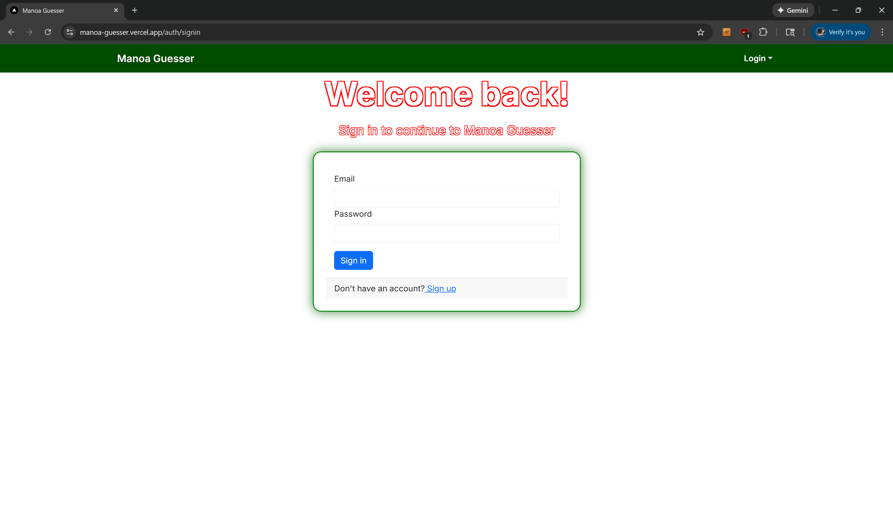
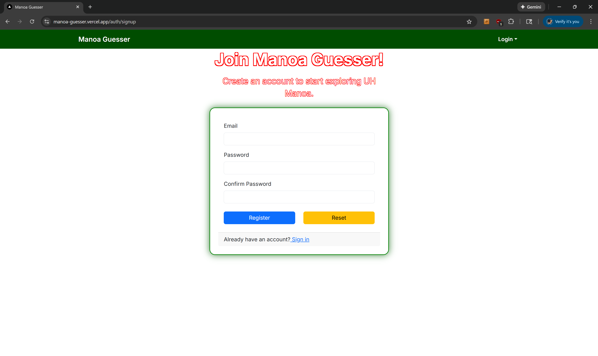
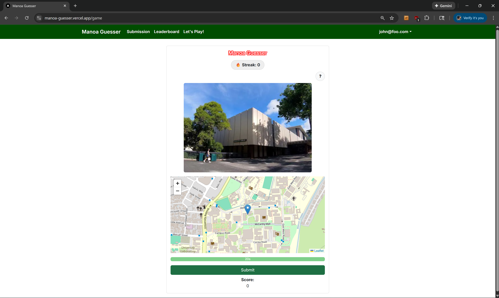
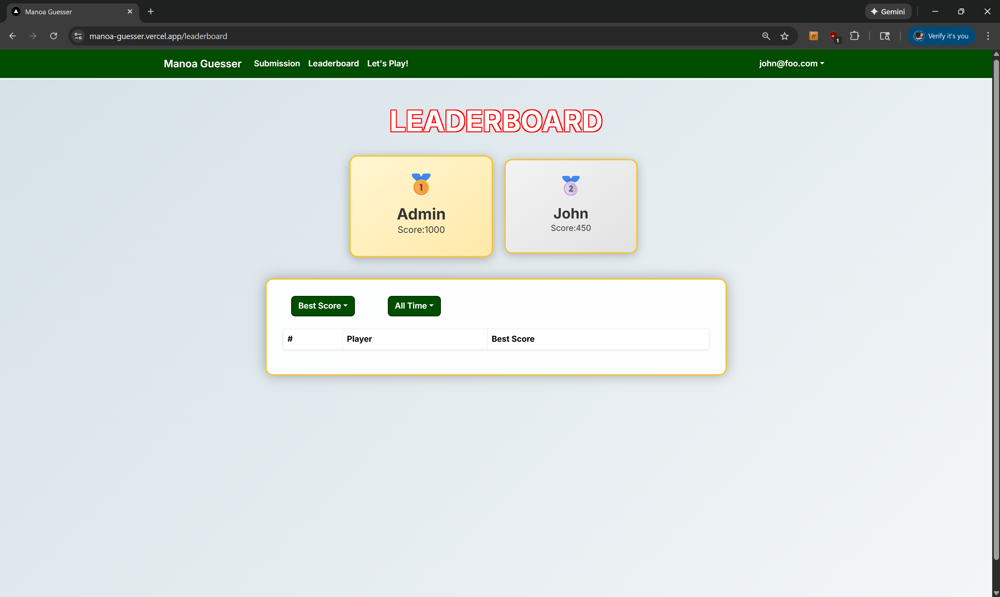
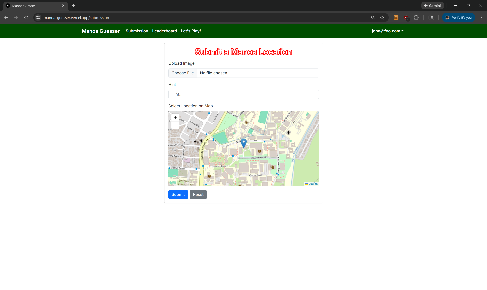
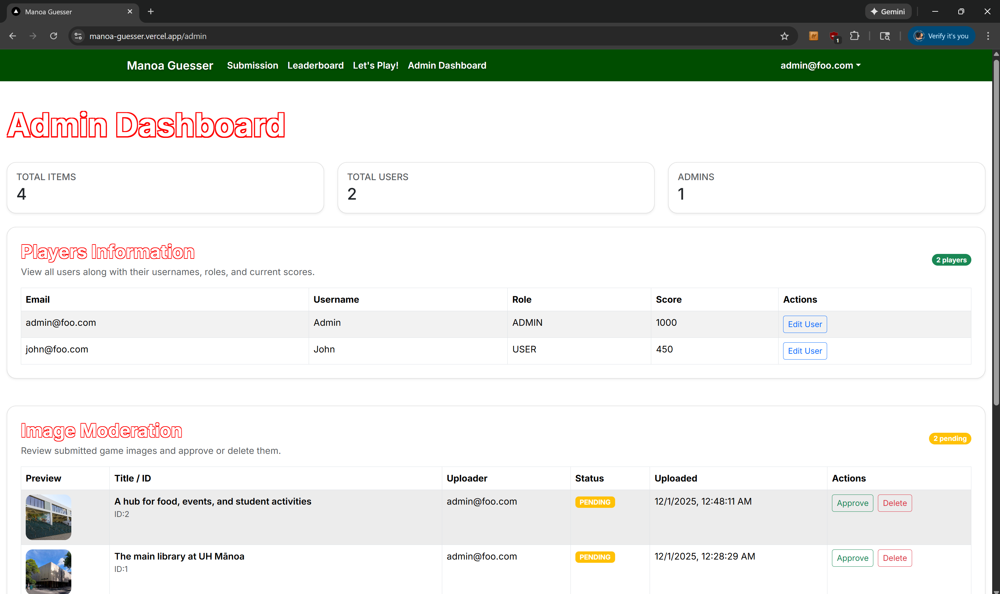
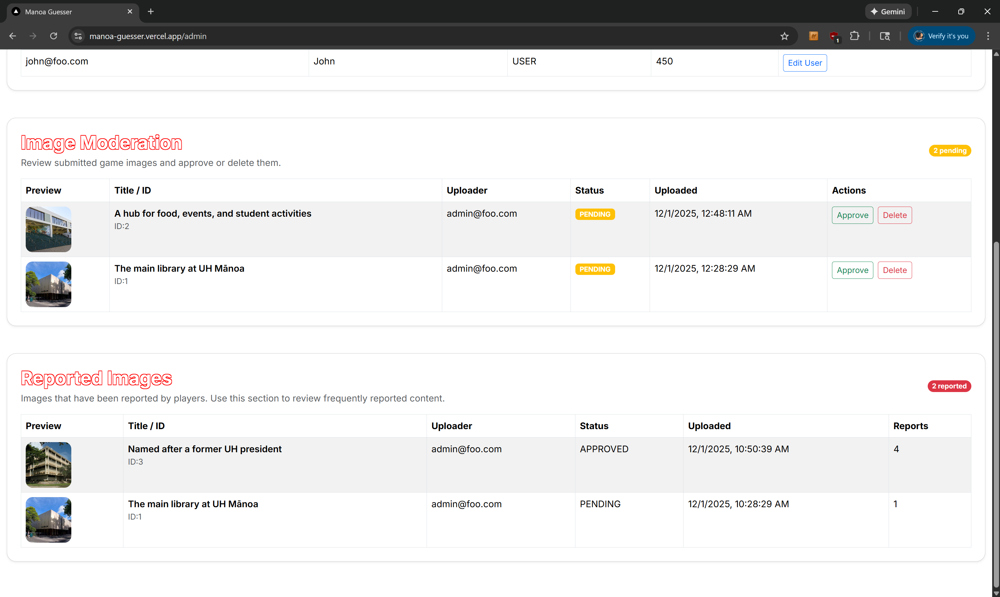
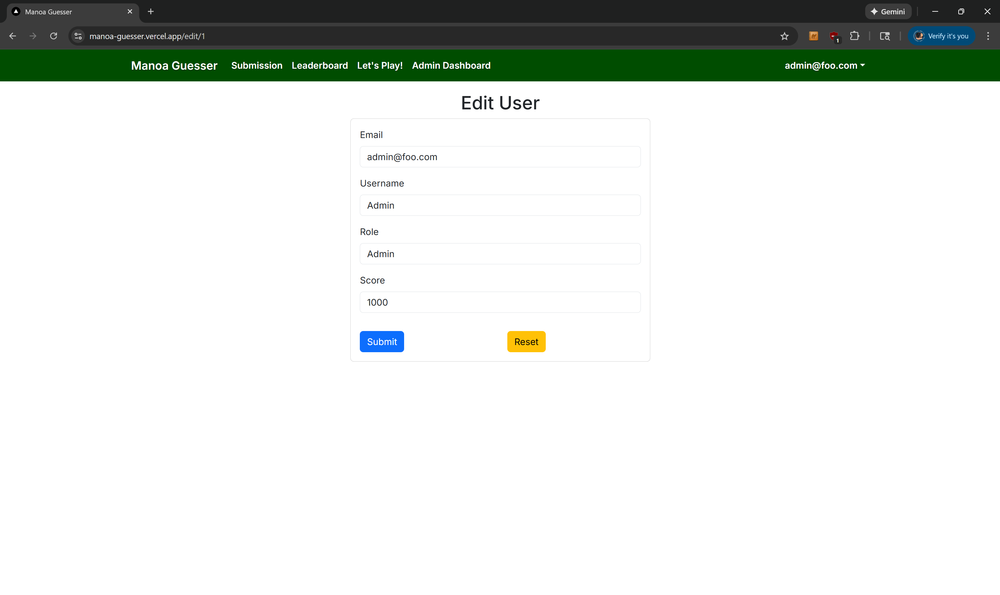

# Manoa Guesser
Link to the GitHub organization can be found [here](https://github.com/manoa-guesser)

[](https://github.com/manoa-guesser/manoa-guesser/actions/workflows/eslint.yml)
[](https://github.com/manoa-guesser/manoa-guesser/actions/workflows/playwright.yml)

## Table of contents

* [Overview](#overview)
* [Deployment](#deployment)
* [User Guide](#user-guide)
* [Community Feedback](#community-feedback)
* [Developer Guide](#developer-guide)
<!-- * [Continuous Integration](#continuous-integration) -->
<!-- * [Walkthrough videos](#walkthrough-videos) -->
<!-- * [Example enhancements](#example-enhancements)  -->
* [Team](#team)


## Overview

**Manoa Guesser** is a gamified exploration web app designed to help students at the University of Hawaiʻi at Mānoa familiarize themselves with campus locations. Every year, UH Mānoa welcomes a new influx of students, many of whom struggle to navigate the large and diverse campus. This project aims to make the process of discovering study spots, landmarks, and hidden corners of campus both fun and engaging.

**The goal:**  
To create a campus-based guessing game that encourages exploration, connection, and familiarity with the UH Mānoa environment through friendly competition and participation.

**The system will eventually provide:**
- A guessing game where users identify locations from random photos taken around UH Mānoa.
- A points-based scoring system rewarding accuracy.
- User-submitted campus photos for community-driven content.
- Administrative moderation tools for managing photo submissions.

### Key Features
- **Interactive Gameplay:** Guess the campus location based on a provided image.
- **Leaderboards:** Track high scores and encourage competition.
- **Photo Submission:** Users can submit their own images for review.
- **Admin Dashboard:** Moderation tools to approve or reject submitted photos.

---

## Deployment

The project was deployed using Vercel and can be found at this [link](https://manoa-guesser.vercel.app/)

# M1 Board
[Link](https://github.com/orgs/manoa-guesser/projects/2)

# M2 Board
[Link](https://github.com/orgs/manoa-guesser/projects/4)

# M3 Board
[Link](https://github.com/orgs/manoa-guesser/projects/8)

---


## User Guide
This User Guide walks through all currently implemented functionality in Manoa Guesser. Each section includes a description of what users can accomplish on each page, along with example screenshots demonstrating the interface and workflow.

### Landing Page

The landing page introduces the app and provides navigation to sign in, sign up, or explore basic information about the project.

- Users can view the project purpose.
- Users can navigate to authentication pages to begin playing.


### Sign In Page

The Sign In page allows existing users to log into their accounts using their registered email and password.

- Users enter credentials to access gameplay, the leaderboard, and submission features.
- Authentication is handled securely using NextAuth.



### Sign Up Page

The Sign Up page enables new users to create an account.

- Users provide an email, password, and other required fields.
- Once registered, they can immediately log in and begin playing.



### Home Page

The Home Page serves as the central hub of the system.

Users can:
- Start a new game.
- View the leaderboard.
- Submit new campus photos.
- Navigate to other parts of the system.

**Screenshot:**  


### Game Page

The Game Page is where gameplay occurs.

Current functionality includes:
- Displaying a campus image for the user to identify.
- Allowing the user to guess a location using the interactive map.
- Showing game results (score, accuracy) once a guess is submitted.



### Leaderboard Page

The Leaderboard page displays user scores in descending order.

Users can:
- View top-performing players.
- See their own best scores.
- Compare performance with others.

Scores automatically update based on gameplay results.



### Submission Page

The Submission Page allows logged-in users to upload their own campus photos to expand the game content.

Users can:
- Upload an image file.
- Provide a location name and a hint.
- Submit the entry for administrative approval.

Once reviewed, approved images may appear in the gameplay rotation. (WIP)




### Admin Dashboard 

If the Admin Dashboard is enabled for your role:
- Admins can view all pending photo submissions.
- Admins can approve or reject images.
- Approved images become available for gameplay.





---
## Community Feedback 

## Developer Guide

This section describes how to set up the development environment for Manoa Guesser, including cloning the project, installing dependencies, configuring environment variables, and running the application locally. This guide is intended for developers contributing to the project.

---

### 1. Prerequisites

Before starting development, ensure you have the following installed:

- **Node.js (v18 or later)**  
- **npm** (comes with Node.js)  
- **Git**  
- **A code editor** such as VS Code

---

### 2. Clone the Repository

Use Git to clone the project into your local workspace:

```bash
git clone https://github.com/manoa-guesser/manoa-guesser.git
cd manoa-guesser
```

---

### 3. Install Dependencies

Install all required Node.js packages:

```bash
npm install
```

This will install Next.js, Prisma, React, Playwright, and all other project dependencies.

---

### 4. Environment Variables

This project requires a `.env` file containing secrets for:

- NextAuth configuration  
- Database connection (Supabase / PostgreSQL)  
- Prisma  
- Session keys  
- Any additional runtime tokens

To obtain the correct environment file:

> **Contact Colbren** for the official `.env` file used in development.

Once received, save it as:

```
.env
```

in the project root directory.

---

### 5. Database Setup (If Required)

If you modify the Prisma schema or need to initialize the local development database:

```bash
npx prisma generate
npx prisma db push
```

You may skip this step if your `.env` points to a hosted database.

---

### 6. Running the Development Server

Start the Next.js dev environment:

```bash
npm run dev
```

Then open the app in your browser at:

```
http://localhost:3000
```

The site will automatically reload when you edit source files.

---

### 7. Running ESLint

To check for linting issues:

```bash
npm run lint
```

Fix any warnings or errors before committing.

---

### 8. Running Playwright Tests

Playwright tests verify game functionality, authentication, and UI behavior.

Install browsers (first time only):

```bash
npx playwright install --with-deps
```

Run all tests:

```bash
npx playwright test
```

---

### 9. Project Structure

A brief overview of the repository layout:

```
/app              – Next.js App Router pages
/components       – Reusable UI components
/lib              – Prisma client and utility libraries
/prisma           – Schema and migrations
/public           – Static assets and images
/tests            – Playwright test suite
```

---

### 10. Continuous Integration

All commits to `main` or `master` automatically trigger:

- ESLint checks  
- Playwright test suite  
- Build verification  

This is done through GitHub Actions (see `.github/workflows/ci.yml`).

Developers should ensure that all CI checks pass before merging pull requests.

---

### 11. Contribution Workflow

Typical development flow:

1. Create a feature branch  
2. Implement changes  
3. Run `npm run lint` and `npx playwright test`  
4. Commit and push your branch  
5. Open a pull request  
6. Ensure CI passes  
7. Request review from team members  

---

### 12. Support

For access issues, environment configuration, or database permissions:

- Ask **Colbren** for `.env` access  
- Contact the team using GitHub Discussions or Group Chat  

---

This completes the Developer Guide for Manoa Guesser.

--- 
### 12. Support


## Team

- [Lawrence Zheng](https://lawrencezheng5.github.io/)
- [Jia Jun Li](https://jiajunli526.github.io/)
- [Joshua Chow](https://zhouweijosh.github.io/)
- [Colbren Fujimoto](https://colbren.github.io/)

[Team Contract](https://docs.google.com/document/d/1WQjzh6r09rr-exfMHNruvm9btdQKU5Tv-qu1LLYoXVQ/edit?usp=sharing)
---